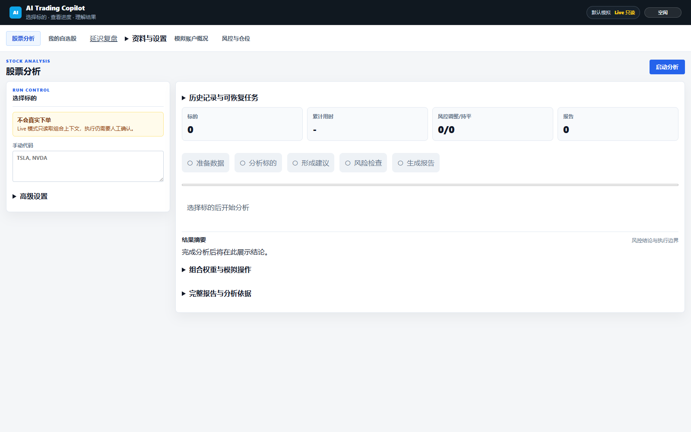
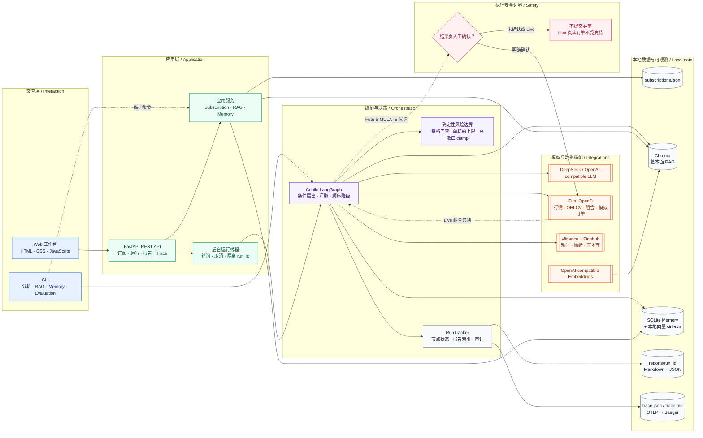
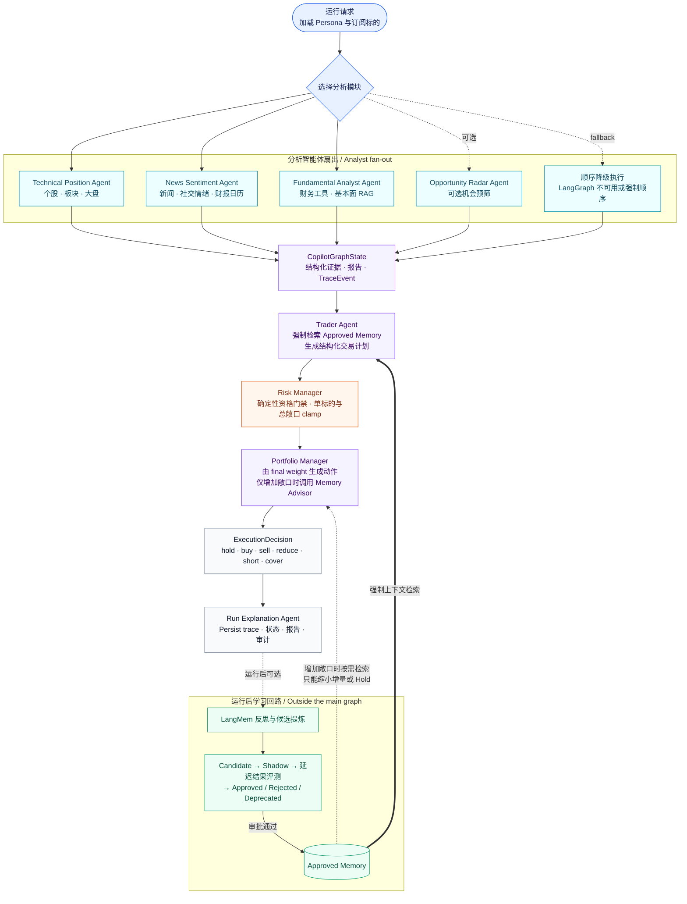

# AI Trading Copilot

<div align="center">

**面向美股与 ETF 的订阅池驱动、多智能体、可解释交易研究 Copilot**

*A subscription-driven, explainable multi-agent research copilot for US stocks and ETFs.*


</div>

AI Trading Copilot 将用户画像、订阅标的、行情、新闻情绪、基本面 RAG 与版本化交易记忆组织成一条结构化决策链。系统先由分析智能体并行收集证据，再由 Trader 形成计划，经确定性 Risk Manager 收紧风险，最后由 Portfolio Manager 生成可解释建议，并为每次运行保存报告与 Trace。

> **安全边界：**这是研究与决策辅助项目，不承诺实时性或投资收益，不支持真实券商下单。Live 组合仅作为只读上下文；Futu `SIMULATE` 模拟单也必须在结果页由用户再次明确确认。

## 项目展示



Web 工作台覆盖股票分析、自选股管理、RAG 知识库、记忆审批与模拟账户概况；运行页可查看节点进度、风控前后权重、建议动作、阶段报告和 Trace。

## 为什么做这个项目

这个项目关注的不是“让多个 Agent 聊天”，而是如何把 AI 应用里的不确定推理放进可验证的软件边界：

- **订阅池驱动：**只研究用户关注的美股与 ETF，避免把选股范围无限扩大。
- **结构化多智能体：**分析证据、交易计划、风险评估和执行建议均使用 Pydantic 模型传递。
- **确定性风控：**LLM 不能绕过标的资格、单标的仓位和组合总敞口限制。
- **可解释与可审计：**节点、工具、LLM 调用、规则命中、错误和耗时都进入本地 Trace。
- **两类长期知识：**Chroma 保存基本面研究材料；SQLite + 本地向量索引保存版本化交易经验。
- **受控学习：**运行后反思只产生 Candidate；Shadow 不注入生产 Prompt；只有 Approved Memory 可被检索。

## 系统架构



### 前后端职责

| 层 | 实现 | 主要职责 |
| --- | --- | --- |
| Browser | 原生 HTML / CSS / JavaScript | 运行控制、订阅管理、RAG 管理、记忆审批、报告与 Trace 展示 |
| API | FastAPI | REST 路由、请求校验、静态资源、运行状态和结果查询 |
| Runtime | 后台线程 + RunTracker | 隔离 `run_id`、执行/取消、节点进度、报告索引 |
| Orchestration | LangGraph | 条件扇出分析节点、状态汇聚、交易与组合决策；缺少 LangGraph 时支持顺序降级 |
| Adapters | Futu / yfinance / Finnhub / LLM | 将外部行情、账户、新闻、模型调用封装成可替换边界 |
| Persistence | JSON / Chroma / SQLite / Markdown / JSON | 订阅、知识、记忆、运行报告和审计 Trace |

## 多智能体决策架构



> 记忆反思和生命周期管理是**运行后的学习回路**，不是主 LangGraph 节点。分析 Agent 不接收交易记忆；Trader 在形成计划时进行 Approved Memory 检索，Portfolio Manager 只在建议会增加总敞口时调用受限的 Memory Advisor。

### Agent 职责与边界

| Agent / 组件 | 输入与产出 | 关键约束 |
| --- | --- | --- |
| Opportunity Radar | 订阅池与市场状态 → 候选机会 | 可选预筛，不直接产生订单 |
| Technical Position | OHLCV、板块与大盘 → 趋势/支撑/位置 | 数据不足时显式降级，不伪造指标 |
| News Sentiment | 新闻、社交情绪、财报日历 → 事件风险 | 证据进入 Trader，不能覆盖风控 |
| Fundamental Analyst | 财务工具数据 + Chroma RAG → 基本面判断 | RAG 是背景证据，最新工具数据优先 |
| Trader | 全部分析证据 + Approved Memory → `TradePlan` | 必须给出止损与失效条件；记忆检索有界 |
| Risk Manager | 计划 + Persona + 当前组合 → `RiskAssessment` | 确定性门禁与仓位 clamp，拒绝记忆越权 |
| Portfolio Manager | 风控后权重 + 当前持仓 → `ExecutionDecision` | Memory Advisor 只能缩小新增风险或 Hold |
| Run Explanation | 最终状态 → 人类可读解释 | 汇总证据、规则命中、决策和错误 |
| Post-trade Learning | 完成的运行与延迟结果 → 候选记忆 | 不自动把 Candidate 注入生产 Prompt |

## 核心数据流

1. 从 `config/subscriptions.json` 或手动输入加载标的，并合并 Persona 与本次运行配置。
2. 所选分析 Agent 通过 LangGraph 扇出；每个节点返回结构化状态、报告和 TraceEvent。
3. Trader 汇聚证据并检索 Approved Memory，生成包含方向、权重、止损和失效条件的计划。
4. Risk Manager 用确定性规则检查资格、单标的上限和总敞口，得到风险调整后的权重。
5. Portfolio Manager 对比当前组合生成动作；Live 组合仅用于只读上下文。
6. RunTracker 写入阶段报告、运行状态、`trace.json` 和 `trace.md`。
7. 若启用长期记忆，主流程结束后再由 LangMem 提炼 Candidate，后续通过 Shadow 评测和人工审批进入 Approved。

## 技术栈

| 领域 | 技术 |
| --- | --- |
| Runtime | Python 3.10+、Pydantic |
| API / UI | FastAPI、Uvicorn、原生 HTML / CSS / JavaScript |
| Agent 编排 | LangGraph、LangChain、LangMem |
| LLM | DeepSeek 或 OpenAI-compatible Chat API |
| 市场与账户 | Futu OpenD、yfinance、Finnhub |
| Fundamental RAG | Chroma、OpenAI-compatible Embeddings、BM25、RRF、rerank、父子分块 |
| Trading Memory | SQLite、可重建本地向量 sidecar、版本化生命周期 |
| 可观测性 | 本地 Trace、OpenTelemetry、OTLP、Jaeger |
| 质量保障 | Pytest、固定 Memory Harness、RAG/Agent Evaluation |

## 5 分钟运行

### 1. 环境与安装

需要 Python 3.10+。在项目根目录执行：

```bash
python -m venv .venv

# Windows PowerShell
.\.venv\Scripts\Activate.ps1

# macOS / Linux
# source .venv/bin/activate

python -m pip install -e ".[dev]"
```

### 2. 配置环境变量

项目会读取根目录 `.env`。以下示例不包含真实密钥；只启用你需要的能力：

```dotenv
# 完整多智能体分析需要
DEEPSEEK_API_KEY=your_deepseek_api_key
DEEPSEEK_BASE_URL=https://api.deepseek.com
DEEPSEEK_MODEL=your_available_model
DEEPSEEK_REASONING_EFFORT=high
DEEPSEEK_THINKING_TYPE=enabled

# 新闻与情绪，可选
FINNHUB_API_KEY=your_finnhub_api_key

# Fundamental RAG 向量召回，可使用兼容端点，可选
OPENAI_API_KEY=your_embedding_api_key
OPENAI_BASE_URL=https://your-compatible-endpoint/v1
OPENAI_EMBEDDING_MODEL=your_embedding_model

# Futu OpenD 行情、组合与模拟订单，可选
FUTU_OPEND_HOST=127.0.0.1
FUTU_OPEND_PORT=11111

# 功能开关，可选
COPILOT_LONG_TERM_MEMORY_ENABLED=true
COPILOT_ENABLE_FUNDAMENTAL_RAG=true
COPILOT_UI_ENABLE_FUNDAMENTAL_RAG=true
```

配置说明：

- `DEEPSEEK_API_KEY`：完整 LLM 决策链需要；未配置时部分确定性组件仍可测试，但不能代表完整分析。
- Futu OpenD：行情、组合上下文和模拟单能力需要；Live 组合始终只读。
- `FINNHUB_API_KEY`：启用 Finnhub 新闻/情绪；其他可用数据适配器会按实现降级。
- Embedding 密钥：只在 Chroma 向量召回、入库和相关评测中需要；也可使用 `DASHSCOPE_API_KEY`。
- OTel、Jaeger 与长期记忆均可独立关闭，不影响 UI 静态页面启动。

### 3. 启动 Web 工作台

```powershell
cd E:\ai_trading_copilot
.\scripts\start-ui.ps1
```

浏览器打开 <http://127.0.0.1:8000>。首次查看界面不要求真实密钥；要完成一次真实数据分析，需要配置相应数据源和 LLM。

启动脚本固定使用本项目 `.venv` 并启用 UTF-8，避免 PATH 中其他 Python 环境的同名命令。服务重启后始终空闲，不自动执行分析、RAG 探测或断点恢复；刷新页面可重新连接本次服务仍存活的任务。

点击“取消运行”后，系统在完整节点边界保存断点，等待显示可恢复后可手动恢复。Ctrl+C、服务退出或强杀会丢弃运行中的进度；强杀遗留的临时文件在下次启动、服务就绪前清理。已经主动取消并保存的断点保留；恢复会消费原断点，恢复途中强杀不会再次恢复旧进度。

需要永久配置当前 Windows 用户的 PowerShell UTF-8 时，运行 `.\scripts\enable-utf8.ps1 -Persist`；脚本保留既有 profile 内容并创建备份。完整行为及验证方式见 [UI 生命周期与编码](docs/ui_lifecycle.md)。

### 4. 运行 CLI

```bash
# 单标的或多标的
ai-trading-copilot AAPL
ai-trading-copilot --symbols AAPL,MSFT

# 从订阅池选择，或分析全部已订阅标的
ai-trading-copilot --select-symbols
ai-trading-copilot --all-subscribed

# 指定分析模块，并在单次运行中关闭长期记忆
ai-trading-copilot AAPL \
  --analysts news_sentiment,technical_position,fundamental_analysis \
  --no-long-term-memory
```

Windows PowerShell 可将最后一个示例写在同一行，或把 Bash 的 `\` 换成反引号续行符。

## RAG 与交易记忆

这两套存储解决不同问题，生命周期也不同：

| 能力 | Fundamental RAG | Trading Memory |
| --- | --- | --- |
| 内容 | 年报、财报、指引、研究笔记等基本面资料 | 历史运行中提炼的交易经验与失败模式 |
| 主存储 | `config/rag_chroma/` | `config/memory.sqlite3` |
| 检索 | Query rewrite → Vector + BM25 → RRF → rerank → parent context | 生命周期/范围过滤 → lexical + 本地向量 ranking |
| 使用者 | Fundamental Analyst | Trader；以及增加敞口时的 Portfolio Memory Advisor |
| 安全策略 | 工具数据优先，检索内容只作背景证据 | Shadow 不注入；仅 Approved 可进入生产上下文 |

### RAG 命令

```bash
# 导入仓库内已审核的默认研究资料
ai-trading-copilot-rag ingest-defaults

# 检查数据库；--probe 会在独立进程中实际打开 Chroma
ai-trading-copilot-rag --chroma-dir config/rag_chroma status --probe

# 调试检索
ai-trading-copilot-rag query \
  --query "AAPL revenue growth and margin risk" \
  --symbol AAPL --tags fundamentals --limit 3
```

### Memory 命令

```bash
ai-trading-copilot-memory status
ai-trading-copilot-memory list --status candidate
ai-trading-copilot-memory versions MEMORY_ID
ai-trading-copilot-memory transition MEMORY_ID shadow
ai-trading-copilot-memory evaluate MEMORY_ID
ai-trading-copilot-memory rollback MEMORY_ID VERSION
```

`--no-memory-learning` 只跳过本次运行后的 LangMem 反思，不会关闭已批准记忆的检索；`--no-long-term-memory` 会同时关闭该次运行的检索与学习。

完整设计见 [向量记忆方案](docs/vector_memory_plan.md) 与 [Memory Harness 工作流](docs/memory_harness.md)。

## 评测、测试与可观测性

### 自动化测试

```bash
python -m pytest tests -q
```

测试覆盖领域模型、LangGraph 路由、API、RAG、版本化记忆、风控边界、模拟执行与 Trace。

### Agent / RAG 评测

```bash
# 确定性工作流 smoke evaluation
ai-trading-copilot-eval agent-smoke --symbols AAPL --format markdown

# 单独分析 Agent 评测
ai-trading-copilot-eval analyst-smoke \
  --analysts news_sentiment,technical_position,fundamental_analysis \
  --symbols AAPL --format markdown

# Fundamental RAG 评测与检索前后对比（需要 eval 依赖）
python -m pip install -e ".[dev,eval]"
ai-trading-copilot-eval fundamental-eval --symbols AAPL --backend ragas --format markdown
ai-trading-copilot-eval rag-compare --backend ragas --top-k 5 --format markdown

# 固定 11 项 Memory / Safety / Prompt Contract 门禁
ai-trading-copilot-harness-benchmark
```

### Trace 与 Jaeger

每次运行都会在对应报告目录生成 `trace.json` 与 `trace.md`。Trace 记录节点、工具、LLM、规则命中、耗时和错误，并对常见敏感字段做脱敏。

```powershell
.\scripts\start-observability.ps1
.\scripts\start-ui-with-otel.ps1
```

然后打开 <http://127.0.0.1:16686>，按服务 `ai-trading-copilot` 或 `run.id` 检索。Jaeger 只接收紧凑元数据与哈希；完整本地详情保留在运行目录。

也可手动配置：

```dotenv
OTEL_EXPORTER_OTLP_ENDPOINT=http://127.0.0.1:4317
OTEL_SERVICE_NAME=ai-trading-copilot
JAEGER_UI_URL=http://127.0.0.1:16686
```

## 目录导览

```text
.
├── copilot/
│   ├── adapters/        # Futu、Finnhub、yfinance 等外部适配器
│   ├── agents/          # 分析、Trader、Risk、Portfolio、Explanation Agent
│   ├── analysis/        # 技术面与市场状态计算
│   ├── domain/          # Pydantic 模型、枚举与本地化
│   ├── graph/           # LangGraph 状态与编排
│   ├── services/        # 订阅、RAG、Memory、Trace、RunTracker
│   └── ui/              # FastAPI 应用与原生前端
├── config/              # Persona、订阅池、Prompt、SQLite/Chroma 默认位置
├── knowledge/           # 经审核的默认基本面研究资料
├── observability/       # Jaeger / OpenTelemetry 本地配置
├── scripts/             # 启动与维护脚本
├── tests/               # 单元、集成与安全边界测试
├── docs/                # 设计文档和面试讲解材料
└── reports/             # 每次运行的报告与 Trace
```

## 安全设计

- **不支持 Live broker order：**系统不会发送真实券商订单，也不调用 `unlock_trade`。
- **模拟单二次确认：**只有 Futu `SIMULATE`，且必须在结果页明确确认，才会提交模拟订单。
- **风险规则确定化：**Risk Manager 对资格、单标的仓位和总敞口执行代码级 clamp。
- **记忆不能提权：**记忆不能扩大风控上限、反转方向，也不能阻止减仓等降低风险的动作。
- **失败可见：**外部服务不可用、数据不足和节点失败进入状态、报告与 Trace，不包装成“成功分析”。
- **敏感信息最小化：**本地报告保存详细审计；OTel 导出只发送精简属性并脱敏常见敏感键。

## 常见问题

**UI 可以打开，但分析失败**

先确认 `DEEPSEEK_API_KEY`、模型名称和兼容端点可用；需要行情/组合时再确认 Futu OpenD 已启动且端口一致。

**RAG 状态显示 `available: null`**

普通 `status` 不打开 Chroma。使用 `status --probe` 或 UI 的刷新按钮实际探测数据库。

**没有 Embedding 密钥**

可查看 UI、运行不依赖向量召回的测试与确定性 Harness；Fundamental RAG 的向量入库/检索需要兼容的 Embedding 凭据。

**Windows 终端显示中文异常**

可先执行 `$env:PYTHONUTF8='1'`，再运行输出较大的 RAG 或评测命令。

## Roadmap

- 增加无密钥的确定性 Demo / Mock 数据与可直接查看的示例运行报告。
- 建立 GitHub Actions、覆盖率、Ruff、Mypy、依赖与 Secret Scanning 门禁。
- 补充 Docker 一键启动、短演示视频、ADR 与版本发布说明。
- 功能继续扩展后，再按业务域拆分较大的 FastAPI 与前端模块。

## Disclaimer

本项目仅用于软件工程研究、技术演示和教育交流，不构成投资建议、收益承诺或自动交易服务。市场数据可能延迟、缺失或错误；任何交易决策及其后果均由使用者自行承担。

UI 精简与内部诊断的启动、权限和验证方式见 [用户工作台与开发诊断](docs/ui_monitoring.md)。
