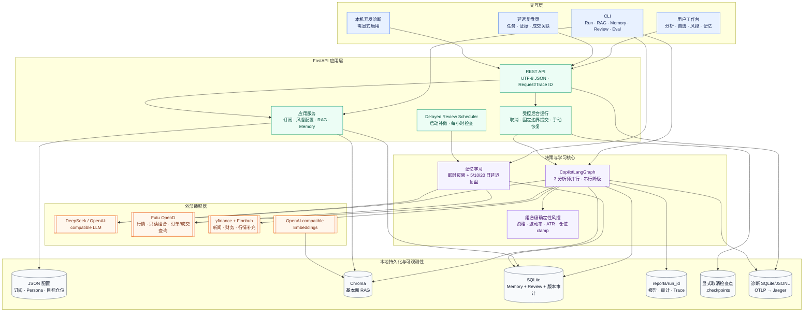
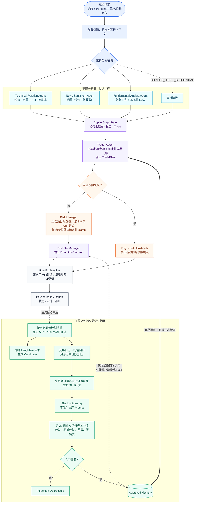

# AI Trading Copilot

<div align="center">

**订阅池驱动、可解释、可复盘的多智能体交易研究系统**

*An explainable multi-agent research copilot with deterministic risk controls and evidence-backed delayed review.*


</div>

AI Trading Copilot 面向美股与 ETF，把行情、技术面、新闻情绪、基本面研究、用户风险偏好和历史交易经验组织为一条可审计的决策链。分析智能体负责收集证据，Trader 形成结构化计划，组合级 Risk Manager 用确定性规则收紧仓位，Portfolio Manager 给出最终建议；运行结束后，系统再用真实时间窗口复盘计划，而不是让 Agent 在一次对话里“自我评价”。

> **边界声明：**本项目是研究与决策辅助系统，不承诺实时性、准确率或投资收益，不支持真实券商下单。Live 账户仅允许只读查询；Futu `SIMULATE` 订单也必须在结果页由用户二次确认。

## 项目截图


当前 Web 工作台包含股票分析、自选股、延迟复盘、研究资料、记忆审批、模拟账户概况、风控与仓位，以及仅限本机显式开启的开发诊断页。

## 项目解决什么问题

常见 Agent Demo 能生成一段观点，却很难回答四个工程问题：证据从哪里来、风险由谁兜底、失败如何恢复、经验是否真的有效。本项目围绕这四点设计：

- **证据可追溯：**技术面、新闻与基本面分别产出结构化结果、Markdown 报告和 Trace。
- **风险不可绕过：**资格、最低收益风险比、波动率/ATR 仓位建议、单标的上限与总敞口由代码执行。
- **运行可控制：**Web 分析支持三分支并行、协作式取消、完整节点边界检查点和显式恢复。
- **失败不伪装成功：**LLM 缺失时 fail closed；组合快照失败时进入 Degraded Hold-only。
- **记忆有生命周期：**Candidate、Shadow、Approved、Rejected、Deprecated 全程版本化，Shadow 不进入生产 Prompt。
- **复盘基于未来证据：**保存原始计划，在第 5/10/20 个完整交易日后用固定行情窗口和明确关联的成交重新评价。
- **诊断与业务隔离：**本地诊断可按 Request ID、Run ID、Trace ID 关联，但不能作为恢复状态。

## 系统架构



### 前后端职责

| 层 | 实现 | 职责 |
| --- | --- | --- |
| 用户界面 | 原生 HTML / CSS / JavaScript | 分析控制、五阶段进度、历史与检查点、风控配置、复盘与记忆审批 |
| API | FastAPI / Pydantic | UTF-8 REST、输入校验、Request/Trace 关联、文件路径边界、静态资源 |
| 运行时 | RunLifecycle / RunTracker | 后台线程、并行分支、取消、检查点、报告发布、终态管理 |
| 决策编排 | LangGraph | 分析扇出、证据汇聚、Trader、Risk、Portfolio、Explanation、Persist |
| 学习服务 | LangMem + Delayed Review | 即时候选提炼、固定周期观察、成交归因、Shadow 评测与人工批准 |
| 外部适配 | Futu / yfinance / Finnhub / LLM | 行情、只读组合、订单成交查询、新闻、财务和模型推理 |
| 存储 | JSON / SQLite / Chroma / Markdown | 用户配置、交易记忆、复盘证据、基本面知识、报告与审计 |
| 可观测性 | Local Trace / Diagnostics / OTel | 调用耗时、Token、异常分组、脱敏事件、Jaeger 导出 |

## 多智能体与记忆闭环



### Agent 职责与硬边界

| Agent / 组件 | 产出 | 不允许做什么 |
| --- | --- | --- |
| Technical Position | 趋势、支撑、回调、ATR、波动率、收益风险证据 | 数据缺失时不得伪造价格或指标 |
| News Sentiment | 新闻、社交情绪、财报事件与引用 | 不得覆盖风险规则或直接决定仓位 |
| Fundamental Analyst | 财务证据、风险标签、基本面 RAG 上下文 | 检索文档只作背景，工具数据优先 |
| Trader | 内部机会复核、`TradePlan`、用户可读报告 | 不再依赖独立 Opportunity Radar Agent；不得跳过确定性入场门禁 |
| Risk Manager | 组合目标、风险挑战、`RiskAssessment`、clamp 记录 | LLM 不能放宽 Persona 或组合上限 |
| Portfolio Manager | `ExecutionDecision` 与组合动作解释 | Memory Advisor 不能扩大风险、反转方向或阻止减仓 |
| Run Explanation | 结论、异议、降级与执行边界 | 不把缺失数据包装成确定结论 |
| Delayed Review | 固定窗口行情、执行归因、反思证据 | 不读取未配置账户、不下单、不用未来数据污染早期复盘 |

## 关键工程设计

### 1. 并行分析与确定性提交

Web 运行默认最多并行执行技术面、新闻情绪和基本面三个分支，每个分支在独立状态副本和临时报告中工作。只有分支完整成功后，协调器才按固定节点顺序提交状态与报告；任一并行分支失败会停止后续 Trader，不发布半成品。设置 `COPILOT_FORCE_SEQUENTIAL=1` 可切换为串行。

### 2. 取消、检查点与恢复

- 点击“取消运行”是协作式停止，只保存最后一个完整节点边界。
- 检查点包含版本化的 Pydantic 状态、已完成节点集合和完整报告，不使用 pickle。
- 恢复必须由用户显式触发；源检查点被消费后不可重复恢复。
- Ctrl+C、服务退出、热重载、强杀或断电不会生成可恢复检查点；遗留临时目录在下次启动前清理。
- 报告、日志、浏览器 localStorage 和旧 `run_status.json` 都不能冒充恢复状态。

### 3. 组合级风控

`config/persona.default.json` 定义默认风险参数；用户配置由“风控与仓位”页面保存到本地 `config/risk_position.user.json`。当前规则包含：

- 最大回撤、单标的最大仓位和组合总敞口；
- 年化目标波动率、单笔风险预算、ATR 止损倍数；
- 最低收益风险比、距支撑最大距离、波动率与 ATR 窗口；
- 针对已有 TradePlan 的目标仓位覆盖。

Risk Manager 先生成组合级建议，再由确定性 `apply_limits` 执行单标的与总敞口 clamp。组合快照不可用时，本次运行进入 Hold-only，不能确认模拟订单。

### 4. RAG 与交易记忆分离

| 能力 | Fundamental RAG | Trading Memory / Review |
| --- | --- | --- |
| 内容 | 年报、季报、指引、财务切片、研究笔记 | 历史计划、经验、命中、结果与延迟复盘证据 |
| 主存储 | `config/rag_chroma/` | `config/memory.sqlite3` |
| 检索 | Query rewrite → Vector + BM25 → RRF → rerank → parent context | 生命周期/时间/Scope 硬过滤 → lexical + 本地向量重排 |
| 使用者 | Fundamental Analyst | Trader；仅增加敞口时的 Portfolio Memory Advisor |
| 安全策略 | 检索材料是非可信背景，最新工具数据优先 | Shadow 不注入；只有 Approved 可进入生产上下文 |

### 5. 延迟复盘不是回测

每份成功计划先持久化原始快照，再登记第 5、10、20 个完整交易日的任务。系统处理节假日、半日市、夏令时、停牌、缺失日线和除权不确定性；证据不足时保持等待，而不是移动窗口或补造结果。

假设观察以首个完整交易日开盘为基准，仅表示标准化行情观察。执行评价只使用明确关联、发生在计划之后且位于截止时间之前的订单与成交；模拟、实盘、账户和基准分别隔离。第 5/10 日用于阶段反馈，默认只有第 20 日结果参与批准门禁，最终仍需人工批准。

完整约束见 [延迟复盘设计](docs/delayed_review.md) 和 [记忆学习与 Harness](docs/memory_harness.md)。

## 快速开始

### 1. 安装

需要 Python 3.10+。仓库包含 `uv.lock`，推荐使用锁定依赖：

```powershell
uv sync --frozen --extra dev
```

也可以使用 pip：

```powershell
python -m venv .venv
.\.venv\Scripts\Activate.ps1
python -m pip install -e ".[dev]"
```

### 2. 配置

项目读取根目录 `.env`，已有进程环境变量优先。以下仅为占位示例：

```dotenv
# 完整分析链需要
DEEPSEEK_API_KEY=your_deepseek_api_key
DEEPSEEK_BASE_URL=https://api.deepseek.com
DEEPSEEK_MODEL=your_available_model
DEEPSEEK_REASONING_EFFORT=high

# 可选数据源
FINNHUB_API_KEY=your_finnhub_api_key
FUTU_OPEND_HOST=127.0.0.1
FUTU_OPEND_PORT=11111

# 可选 Embedding 兼容端点
OPENAI_API_KEY=your_embedding_api_key
OPENAI_BASE_URL=https://your-compatible-endpoint/v1
OPENAI_EMBEDDING_MODEL=your_embedding_model

# 功能开关
COPILOT_LONG_TERM_MEMORY_ENABLED=true
COPILOT_UI_ENABLE_FUNDAMENTAL_RAG=true
```

| 依赖 | 什么时候需要 |
| --- | --- |
| DeepSeek / compatible Chat API | 完整分析、即时报错解释和记忆反思 |
| Futu OpenD | 行情、组合上下文、模拟订单；延迟复盘中的交易日历和可选订单/成交只读同步 |
| Finnhub | 新闻、情绪和部分数据降级 |
| Embedding API | Chroma 向量入库、检索及相关评测 |
| OTel / Jaeger | 分布式 Trace 导出；未配置时仍保留本地 Trace 和诊断 |

### 3. 启动 Web UI

```powershell
.\scripts\start-ui.ps1
```

打开 <http://127.0.0.1:8000>。脚本固定使用项目 `.venv` 并启用 UTF-8。页面刷新只重连当前服务的活任务，不会自动启动分析、恢复检查点或探测 RAG。

开发诊断默认关闭，只能在本机显式开启：

```powershell
.\scripts\start-ui.ps1 -Internal
```

然后访问 <http://127.0.0.1:8000/internal/observability>。不要将内部诊断入口直接暴露到公网。

### 4. 运行 CLI

```powershell
# 单标的或批量分析
ai-trading-copilot AAPL
ai-trading-copilot --symbols AAPL,MSFT

# 从订阅池选择
ai-trading-copilot --select-symbols
ai-trading-copilot --all-subscribed

# 选择分析师或关闭本次长期记忆
ai-trading-copilot AAPL --analysts technical_position,news_sentiment
ai-trading-copilot AAPL --no-long-term-memory
```

## 数据与学习命令

### Fundamental RAG

```powershell
ai-trading-copilot-rag ingest-defaults
ai-trading-copilot-rag --chroma-dir config/rag_chroma status --probe
ai-trading-copilot-rag query --query "AAPL margin risk" --symbol AAPL --tags fundamentals --limit 3
```

### Memory 管理与效果评测

```powershell
ai-trading-copilot-memory status
ai-trading-copilot-memory list --status candidate
ai-trading-copilot-memory transition MEMORY_ID shadow
ai-trading-copilot-memory evaluate MEMORY_ID
ai-trading-copilot-memory rollback MEMORY_ID VERSION

# 默认离线；--live 才会调用真实模型进行有/无记忆成对试验
ai-trading-copilot-memory-eval --output reports/memory-effect-offline.json
```

### 延迟复盘

```powershell
ai-trading-copilot-review list
ai-trading-copilot-review run-due
ai-trading-copilot-review show REVIEW_ID
ai-trading-copilot-review fills
ai-trading-copilot-review retry REVIEW_ID
```

UI 启动时会补做到期任务，之后每小时检查一次；未运行 UI 时可由外部调度器调用 `run-due`。项目本身不会安装系统定时任务。

默认不读取任何交易账户。如需只读同步，必须显式配置账户与基准：

```dotenv
COPILOT_REVIEW_ACCOUNTS=[{"trd_env":"SIMULATE","acc_id":123}]
COPILOT_REVIEW_BENCHMARKS={"US":"SPY","HK":"HK.02800"}
COPILOT_REVIEW_HORIZONS=[5,10,20]
```

配置真实账户前，请确认数据最小化和模型数据处理边界；该流程只查询，不解锁账户、不提交订单。

## 测试、评测与可观测性

```powershell
# 全量测试
.\.venv\Scripts\python.exe -X utf8 -m pytest tests -q

# Agent / RAG 评测
ai-trading-copilot-eval agent-smoke --symbols AAPL --format markdown
ai-trading-copilot-eval analyst-smoke --symbols AAPL --format markdown
ai-trading-copilot-eval rag-compare --backend ragas --top-k 5 --format markdown

# 固定 Memory / Safety / Prompt Contract 门禁
ai-trading-copilot-harness-benchmark
```

当前工作区基线（2026-09-10）：`447 passed, 1 skipped`。跳过项仅涉及 Windows 环境不可用的符号链接能力，不是业务测试失败。

每次运行写入 `trace.json`、`trace.md`、阶段报告和运行审计。本地开发诊断额外聚合工具/模型耗时、真实返回的 Token usage、缓存命中与脱敏异常。OTel 导出失败不会改变业务终态。

```powershell
.\scripts\start-observability.ps1
.\scripts\start-ui-with-otel.ps1
```

Jaeger 默认地址为 <http://127.0.0.1:16686>，服务名为 `ai-trading-copilot`。

可复现基线：

- [延迟复盘离线基线](docs/delayed_review_baseline.json)：固定假数据，不连接账户、不提交订单。
- [延迟复盘真实联调记录](docs/delayed_review_live_20260910.json)：脱敏后的空成交窗口验证，不代表非空实盘归因已验证。
- [Memory 效果基线](docs/memory_baseline_20260909.json)：记录已知误召回与评测边界，不把确定性 fallback 计作模型收益。

## 目录导览

```text
.
├── copilot/
│   ├── adapters/        # Futu、Finnhub、yfinance、复盘数据适配
│   ├── agents/          # 三类分析师、Trader、Risk、Portfolio、Explanation
│   ├── graph/           # LangGraph 状态、并行提交与恢复入口
│   ├── services/        # Lifecycle、RAG、Memory、Review、Trace、Diagnostics
│   └── ui/              # FastAPI API 与原生前端
├── config/              # Persona、Prompt、订阅、用户风险配置、评测用例
├── knowledge/           # 经审核的基本面资料与待处理原始资料
├── observability/       # OTel Collector / Jaeger 本地配置
├── scripts/             # UI、可观测性、UTF-8 与资料处理脚本
├── tests/               # 单元、集成、并行、生命周期和安全边界测试
├── docs/                # 设计、基线、导学与面试材料
└── reports/             # 运行报告、Trace、临时状态和检查点
```

## 安全与隐私边界

- 不支持真实券商下单，不调用 `unlock_trade`。
- Futu `SIMULATE` 订单必须结果页二次确认，包含幂等、数量、重试和价格漂移门禁。
- Degraded、取消、失败或组合未知的运行不能确认模拟订单。
- 延迟复盘默认不读取账户；配置账户后仍只有行情、交易日历、订单和成交查询权限。
- 记忆不能修改代码级风控，不能扩大风险上限，也不能阻止风险降低动作。
- 外部文本被视为非可信数据；Prompt 保留结构化输出合同和证据防护。
- Trace/诊断对密钥、Token、Header、账户字段和自由文本中的常见凭据进行脱敏。
- 内部诊断仅接受本机访问；远程部署前必须增加独立认证和授权。

## 常见问题

**UI 可以打开，但分析立即降级**

检查 `DEEPSEEK_API_KEY` 与模型配置。缺少 LLM 时系统会 fail closed，不会用确定性 fallback 冒充完整模型分析。

**组合读取失败后为什么全部 Hold？**

系统无法确认当前敞口时不能安全计算新增风险，因此保持所有目标为零，并把运行标记为 Degraded。

**点击取消后为什么不能立刻退出？**

取消是协作式的；不支持取消的外部调用需要等待返回或超时。只有完整节点边界被保存，避免恢复半份状态。

**RAG 状态显示 `available: null`**

普通状态查询不会打开 Chroma。使用 `status --probe` 或 UI 中的显式刷新进行探测。

**延迟复盘为什么一直等待？**

交易周期未到、日线缺失、停牌、除权不确定、历史成交能力不足或缺少基准时都会等待/失败关闭，不会用后续数据补齐固定窗口。

## Roadmap

- 提供无需密钥的确定性 Demo 数据和可直接查看的完整示例报告。
- 增加 GitHub Actions、覆盖率、Ruff、Mypy、依赖与 Secret Scanning。
- 为远程部署补齐认证、权限、数据保留策略和独立任务队列。
- 增加 Docker 一键启动、短演示视频、ADR 和版本发布说明。
- 用更多独立交易样本持续验证 Memory 是否真正改善模型决策。

## Disclaimer

本项目仅用于软件工程研究、技术演示和教育交流，不构成投资建议、收益承诺或自动交易服务。市场与账户数据可能延迟、缺失或错误；任何交易决策及其后果均由使用者自行承担。
